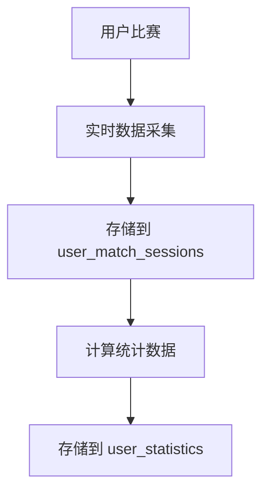

# 🗄️ 用户数据库表结构设计

基于用户认证系统集成，设计个人数据私有化和匿名排行榜的数据库架构。

## 📊 设计原则

- **隐私优先**: 个人数据完全私有，不对外展示
- **匿名排行**: 排行榜仅显示用户名，不泄露敏感信息
- **城市分组**: 按城市级别进行排行榜分组
- **定期更新**: 每周更新一次排行榜数据

## 🔐 核心表结构

### 1. 用户个人数据表 (user_match_sessions)
```sql
CREATE TABLE user_match_sessions (
  id SERIAL PRIMARY KEY,
  authing_user_id VARCHAR(50) NOT NULL,     -- Authing用户ID
  match_id VARCHAR(100) NOT NULL,           -- 比赛ID
  global_id INTEGER,                        -- 球场内球员编号
  confidence DECIMAL(3,2),                  -- 识别置信度
  session_start TIMESTAMP,                  -- 会话开始时间
  session_end TIMESTAMP,                    -- 会话结束时间
  created_at TIMESTAMP DEFAULT NOW(),
  updated_at TIMESTAMP DEFAULT NOW(),
  
  -- 隐私控制
  is_private BOOLEAN DEFAULT TRUE,          -- 是否私有（默认私有）
  allow_leaderboard BOOLEAN DEFAULT FALSE,  -- 是否允许参与排行榜
  
  -- 地理信息（用于城市分组）
  city VARCHAR(100),                        -- 城市
  country VARCHAR(50) DEFAULT 'China',      -- 国家
  
  -- 索引
  INDEX idx_user_match (authing_user_id, match_id),
  INDEX idx_city_leaderboard (city, allow_leaderboard, created_at)
);
```

### 2. 用户运动统计表 (user_statistics)
```sql
CREATE TABLE user_statistics (
  id SERIAL PRIMARY KEY,
  authing_user_id VARCHAR(50) NOT NULL,     -- Authing用户ID
  match_id VARCHAR(100) NOT NULL,           -- 比赛ID
  session_id INTEGER REFERENCES user_match_sessions(id),
  
  -- 运动数据
  total_distance_km DECIMAL(6,3),           -- 总跑动距离(km)
  max_speed_kmh DECIMAL(5,2),               -- 最大速度(km/h)
  avg_speed_kmh DECIMAL(5,2),               -- 平均速度(km/h)
  active_time_minutes INTEGER,              -- 活跃时间(分钟)
  calories_burned INTEGER,                  -- 消耗卡路里
  
  -- 位置数据统计
  position_category VARCHAR(20),            -- 位置类别(前锋/中场/后卫/守门员)
  field_coverage_percentage DECIMAL(5,2),   -- 场地覆盖率
  
  -- 时间戳
  match_date DATE NOT NULL,
  created_at TIMESTAMP DEFAULT NOW(),
  
  -- 索引
  INDEX idx_user_stats (authing_user_id, match_date),
  INDEX idx_match_stats (match_id, match_date),
  INDEX idx_position_stats (position_category, match_date)
);
```

### 3. 排行榜数据表 (leaderboard_data)
```sql
CREATE TABLE leaderboard_data (
  id SERIAL PRIMARY KEY,
  
  -- 匿名化信息
  user_display_name VARCHAR(50) NOT NULL,   -- 用户显示名称（非真实姓名）
  user_hash VARCHAR(64) NOT NULL,           -- 用户哈希值（用于去重，不可逆）
  
  -- 地理分组
  city VARCHAR(100) NOT NULL,               -- 城市
  region_code VARCHAR(10),                  -- 地区代码
  
  -- 统计数据
  total_distance_km DECIMAL(6,3),           -- 总距离
  max_speed_kmh DECIMAL(5,2),               -- 最大速度
  avg_speed_kmh DECIMAL(5,2),               -- 平均速度
  match_count INTEGER,                      -- 比赛场次
  active_days INTEGER,                      -- 活跃天数
  
  -- 位置相关
  primary_position VARCHAR(20),             -- 主要位置
  position_rank INTEGER,                    -- 该位置排名
  
  -- 排行榜元数据
  ranking_week VARCHAR(10) NOT NULL,        -- 排行榜周次(如: 2025-W01)
  ranking_month VARCHAR(7) NOT NULL,        -- 排行榜月份(如: 2025-01)
  last_updated TIMESTAMP DEFAULT NOW(),
  
  -- 索引
  INDEX idx_city_week (city, ranking_week),
  INDEX idx_position_ranking (primary_position, city, position_rank),
  INDEX idx_weekly_ranking (ranking_week, total_distance_km DESC),
  UNIQUE KEY unique_user_week (user_hash, city, ranking_week)
);
```

### 4. 排行榜配置表 (leaderboard_config)
```sql
CREATE TABLE leaderboard_config (
  id SERIAL PRIMARY KEY,
  
  -- 配置信息
  config_key VARCHAR(50) NOT NULL UNIQUE,
  config_value TEXT,
  description VARCHAR(200),
  
  -- 时间戳
  created_at TIMESTAMP DEFAULT NOW(),
  updated_at TIMESTAMP DEFAULT NOW()
);

-- 插入默认配置
INSERT INTO leaderboard_config (config_key, config_value, description) VALUES
('update_frequency', 'weekly', '排行榜更新频率'),
('min_matches_for_ranking', '3', '参与排行榜的最少比赛场次'),
('ranking_retention_weeks', '12', '排行榜数据保留周数'),
('city_grouping_enabled', 'true', '是否启用城市分组'),
('privacy_default', 'private', '隐私设置默认值');
```

## 🔄 数据处理流程

### 1. 数据收集阶段


### 2. 排行榜生成阶段（每周执行）
```sql
-- 生成排行榜数据的存储过程
DELIMITER //
CREATE PROCEDURE GenerateWeeklyLeaderboard(IN week_string VARCHAR(10))
BEGIN
    -- 清除该周的旧数据
    DELETE FROM leaderboard_data WHERE ranking_week = week_string;
    
    -- 生成新的排行榜数据
    INSERT INTO leaderboard_data (
        user_display_name, user_hash, city, total_distance_km, 
        max_speed_kmh, avg_speed_kmh, match_count, primary_position, 
        ranking_week, ranking_month
    )
    SELECT 
        u.nickname AS user_display_name,
        SHA2(CONCAT(u.authing_user_id, week_string), 256) AS user_hash,
        s.city,
        SUM(st.total_distance_km) AS total_distance_km,
        MAX(st.max_speed_kmh) AS max_speed_kmh,
        AVG(st.avg_speed_kmh) AS avg_speed_kmh,
        COUNT(DISTINCT st.match_id) AS match_count,
        MODE(st.position_category) AS primary_position,
        week_string AS ranking_week,
        DATE_FORMAT(NOW(), '%Y-%m') AS ranking_month
    FROM user_statistics st
    JOIN user_match_sessions s ON st.session_id = s.id
    JOIN authing_users u ON s.authing_user_id = u.id
    WHERE s.allow_leaderboard = TRUE
        AND YEARWEEK(st.match_date) = YEARWEEK(STR_TO_DATE(CONCAT(week_string, '-1'), '%Y-W%u-%w'))
        AND s.city IS NOT NULL
    GROUP BY u.authing_user_id, s.city
    HAVING match_count >= 3; -- 至少3场比赛才能上榜
    
    -- 计算排名
    SET @rank = 0;
    SET @prev_city = '';
    SET @prev_pos = '';
    
    UPDATE leaderboard_data ld
    SET position_rank = (
        SELECT ranking FROM (
            SELECT id, 
                   ROW_NUMBER() OVER (
                       PARTITION BY city, primary_position 
                       ORDER BY total_distance_km DESC
                   ) as ranking
            FROM leaderboard_data 
            WHERE ranking_week = week_string
        ) ranked 
        WHERE ranked.id = ld.id
    )
    WHERE ranking_week = week_string;
    
END //
DELIMITER ;
```

## 📱 API接口设计

### 1. 个人数据API
```typescript
// GET /api/user/stats
interface UserStatsResponse {
  userId: string;
  stats: {
    totalDistance: number;
    averageSpeed: number;
    maxSpeed: number;
    matchCount: number;
    bestPosition: string;
    weeklyData: Array<{
      week: string;
      distance: number;
      matches: number;
    }>;
  };
  privacy: {
    isPrivate: boolean;
    allowLeaderboard: boolean;
  };
}

// PUT /api/user/privacy
interface PrivacyUpdateRequest {
  isPrivate: boolean;
  allowLeaderboard: boolean;
  city?: string;
}
```

### 2. 排行榜API
```typescript
// GET /api/leaderboard
interface LeaderboardResponse {
  week: string;
  city: string;
  rankings: Array<{
    rank: number;
    displayName: string; // 匿名化显示名
    position: string;
    totalDistance: number;
    averageSpeed: number;
    matchCount: number;
  }>;
  userRank?: number; // 当前用户排名（如果参与）
}

// GET /api/leaderboard/cities
interface CitiesResponse {
  cities: Array<{
    city: string;
    playerCount: number;
    lastUpdated: string;
  }>;
}
```

## 🔒 隐私保护措施

### 1. 数据匿名化
- 排行榜使用哈希值而不是真实用户ID
- 仅显示用户选择的昵称，不显示真实姓名
- 地理位置精确到城市级别，不存储详细地址

### 2. 权限控制
- 默认所有数据为私有
- 用户主动选择是否参与排行榜
- 提供数据删除和退出机制

### 3. 数据安全
- 敏感数据加密存储
- API访问需要认证
- 定期清理过期数据

## 🎯 使用示例

### 1. 用户查看个人数据
```typescript
const { data: userStats } = await fetch('/api/user/stats', {
  headers: { Authorization: `Bearer ${accessToken}` }
});
```

### 2. 用户设置隐私选项
```typescript
await fetch('/api/user/privacy', {
  method: 'PUT',
  headers: { 
    'Content-Type': 'application/json',
    Authorization: `Bearer ${accessToken}` 
  },
  body: JSON.stringify({
    isPrivate: false,
    allowLeaderboard: true,
    city: '北京'
  })
});
```

### 3. 查看城市排行榜
```typescript
const { data: leaderboard } = await fetch(`/api/leaderboard?city=北京&position=中场`);
```

---

**🎉 总结**: 这个数据库设计充分考虑了隐私保护和用户体验，既能提供个性化的个人数据分析，又能通过匿名排行榜激发用户的竞技兴趣，同时严格保护用户隐私。